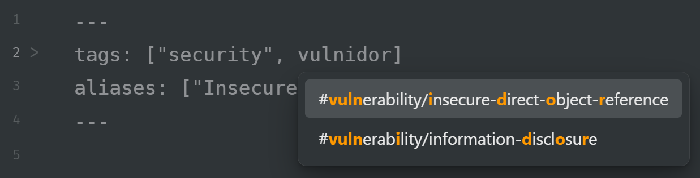

# Fuzzytag

Strongly based on tge Frontmatter Tag Suggest plugin
https://github.com/jmilldotdev/obsidian-frontmatter-tag-suggest

This plugin has been made because fuzzy search would change the functionality of the original plugin, which might not be desired by everyone.
Thanks to the original plugin developer for the inspiration and base for creating this plugin

## Known issues:

Hacky implementation of highlighting in suggestions means that tags with special characters (`<` or `>`) might break. Feel free to submit a PR if this doesnt work with your workflow.
Only works with array style tag definition
